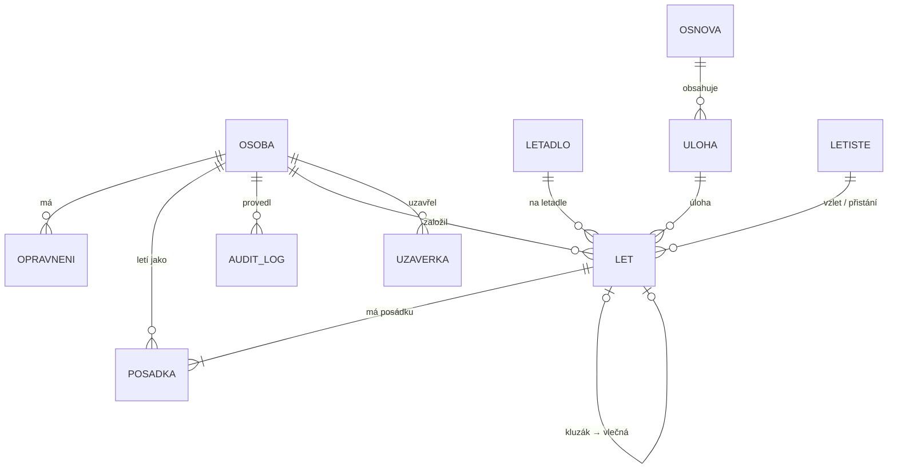

# LKKL Log – návrh aplikace pro evidenci letů

*Verze návrhu 6.1 · 4. 10. 2026*

**Změny ve verzi 6.1:** zpětná vazba od členů (kap. 3.6): dodatečný zápis letu, souběh, OGN.

**Změny oproti verzi 5:**
- **fáze spuštění** (kap. 9.1): nejdřív jen správce, pak testovací skupina, pak celý klub;
- režim odesílání e-mailů, „Přihlásit se jako…“, označení testovacího provozu, úklid před spuštěním.

**Změny ve verzi 5 oproti verzi 4:**
- **kdo let platí** (plátce);
- zjištění z DNS (Cloudflare, e-mail zatím zakázaný);
- potvrzená oprávnění.

**Změny ve verzi 4 oproti verzi 3:**
- název **LKKL Log**;
- tři možnosti u velmi krátkých letů;
- role „služba“ přejmenována na „časoměřič / věž“;
- souhrny rozlišují vlek a ostatní lety téhož letadla;
- Docker spravovaný přes VPS Centrum.

**Změny ve verzi 3 oproti verzi 2:**
- uzávěrka je souhrn (součty), ne zámek, a opravy po ní jsou možné a evidované;
- externí examinátor se eviduje jménem;
- velmi krátké lety (do 1 min);
- nastavitelný export;
- data databáze na disku serveru;
- automatické čištění starých image.

**Změny ve verzi 2 oproti verzi 1:**
- typ letu je teď hierarchie (kategorie × účel: normální / výcvik / výcvik sólo / přezkoušení / vlek);
- pravidla posádky podle typu letu;
- externí osoby se evidují jen počtem;
- denní a měsíční uzávěrka;
- role účetní;
- důvody zrušení letu;
- maximální doba letu u letadla;
- soumrak;
- automatické nasazování (kap. 7).

---

## 0. Výchozí stav serveru

| Položka | Stav | Co to znamená |
|---|---|---|
| Server | `one12.vas-server.cz`, Debian 13 (trixie), 4 GB RAM, 20 GB disk | Pro desítky uživatelů výkonově stačí. |
| Disk | 65 % obsazeno, volných ~7 GB | Stačí. Staré Docker image se musí pravidelně mazat (nasazovací skript to bude dělat sám). |
| Paměť | Při měření obsazeno ~89 % (3,7 z 4 GB) | **Je potřeba ověřit.** Může jít jen o cache systému (nevadí), nebo o skutečně plnou paměť (vadí). Aplikace i s databází potřebuje cca 300–500 MB. |
| Subdoména `lety.lkkl.cz` | ve VPS Centru neexistuje. V DNS je ale záznam `*.lkkl.cz`, takže adresa už vede na server. | Ve VPS Centru se založí v etapě 0. DNS záznam není potřeba. |
| DNS `lkkl.cz` | spravuje Váš Hosting, provoz jde přes **Cloudflare proxy** (prostředník, který chrání web a zrychluje ho) | Funguje to. Aplikace musí brát skutečnou IP adresu uživatele z hlavičky od Cloudflare, jinak by omezení pokusů o přihlášení blokovalo všechny najednou. |
| Schránka `info@lkkl.cz` | neexistuje. Doména nemá MX záznam (adresu poštovního serveru) a SPF `v=spf1 -all` spolu s DMARC `p=reject` říkají, že **z `lkkl.cz` se nesmí odesílat žádná pošta**. | Založí se ve VPS Centru. Pak je potřeba upravit DNS: přidat MX, povolit server v SPF a přidat DKIM (elektronický podpis pošty). Jinak budou e-maily z aplikace odmítnuty. |
| Databáze | neexistuje | **Ve VPS Centru se zakládat nebude.** PostgreSQL poběží v Dockeru spolu s aplikací. |

---

## 1. Jak aplikace funguje jako celek

**Jedna webová aplikace** na adrese `https://lety.lkkl.cz`. Otevírá se v prohlížeči na mobilu, tabletu i počítači a vzhled se přizpůsobí velikosti displeje. Na mobilu se dá „nainstalovat“ na plochu jako ikona. Technicky jde o tzv. **PWA** (Progressive Web App, tedy webovou stránku, která se chová jako aplikace a nepotřebuje App Store).

```
 Mobil / tablet / PC / TV na věži
        │  (HTTPS – šifrované spojení)
        ▼
 nginx na VPS (vrátný: přijme požadavek, vyřídí certifikát, pošle dál)
        │
        ▼
 ┌──────────── Docker ────────────┐
 │  Aplikace (Python / Django)    │──► e-maily (SMTP, info@lkkl.cz)
 │        │                       │
 │        ▼                       │
 │  Databáze PostgreSQL           │──► noční zálohy (+ kopie mimo server)
 └────────────────────────────────┘
        ▲
        │ automatické nasazení po každé schválené změně
 GitHub (zdrojový kód) ─ GitHub Actions (testy, sestavení)
```

### Typický letový den

1. Časoměřič nebo věž (případně pilot, když nikdo jiný není) otevře **Přehled dne**.
2. Ťukne **+ Nový let** → vybere letadlo → typ letu → posádku → úlohu → **Vzlet**. Je to zhruba 5 ťuknutí a nic se nepíše.
3. Let se objeví ve skupině **Ve vzduchu** s běžícím časem se sekundami (např. `0:07:45`), a to na všech zařízeních do ~10 sekund.
4. Motorová letadla, TMG a UL mají vedle **Přistál** tlačítko **T&G**: každé ťuknutí zapíše touch-and-go s časem (dvě ťuknutí do 30 s se berou jako jedno, omyl vrátí tlačítko Zpět). Kluzáky T&G nemají.
5. Při přistání stačí ťuknout na **Přistál**; počet touch-and-go je předvyplněný z letu a jde upravit tlačítky +/−.
6. Zapomenutý start nebo stop se opraví a důvod opravy se vybere z nabídky. Každá změna se zapíše do historie.
7. Večer časoměřič nebo věž den **uzavře** (jinak se uzavře sám druhý den v 5:00). Účetní na konci měsíce zkontroluje lety, opraví chyby, uzavře měsíc a vyexportuje data.

### Zásady, na kterých návrh stojí

- **Žádné psaní:** vše se vybírá. Nejčastější volby jsou nahoře a co jde odvodit, se předvyplní.
- **Jedny hodiny pro všechny:** čas „teď“ určuje server, ne hodiny v telefonu.
- **Nic se nemaže:** let se jen zruší (s důvodem) a každá změna se uloží do **auditního logu** (historie změn: kdo, kdy, co z čeho na co a proč).
- **Časy v UTC, na sekundy.** Doba letu = (přistání − vzlet), zaokrouhleno na celé minuty (30 s a víc nahoru). Součty se pak dělají z celých minut a dál se nezaokrouhlují.

---

## 2. Doporučené technologie

### Doporučená varianta

| Vrstva | Technologie | Proč |
|---|---|---|
| Backend (logika na serveru) | **Python 3.14 + Django 6** | Má hotové přihlašování, správu uživatelů, administraci číselníků, migrace (řízené změny struktury databáze) i ochranu proti běžným útokům. U aplikace tohoto typu to ušetří týdny práce. |
| API (rozhraní mezi frontendem a backendem) | **Django Ninja** | Píše se podobně jako FastAPI: typované Python funkce s Pydantic modely a automatická dokumentace API. |
| Databáze | **PostgreSQL 18** | Spolehlivá, umí hlídat pravidla přímo v databázi (např. „jedno letadlo nemůže mít dva lety ve vzduchu“), dobře se zálohuje. |
| Frontend (co vidí uživatel) | **React + TypeScript + Vite** | React už znáte. TypeScript (JavaScript s typy) chytá chyby už při psaní. Vite je rychlý nástroj na sestavení. |
| UI knihovna | **Mantine** | Hotové komponenty (velká tlačítka, výběry, výběr času, tabulky) s podporou dotykového ovládání a češtiny. |
| Načítání dat | **TanStack Query** | Stará se o načítání a průběžné obnovování dat (autorefresh) jedním nastavením. |
| Provoz | **Docker Compose** + nginx z VPS Centra + certifikát Let's Encrypt | Celá aplikace se spouští jedním příkazem. Lokálně i na serveru běží stejně. |
| Nasazování | **GitHub + GitHub Actions** | Automatické testy a nasazení po každé schválené změně (kap. 7). |
| Pomocné knihovny | `astral` (západ slunce a soumrak pro LKKL), `openpyxl` (Excel), `argon2` (bezpečné ukládání hesel) | – |

**Proč Django a ne FastAPI:** FastAPI je skvělé na čisté API, ale přihlašování, role, administraci a migrace byste si musel skládat z jiných knihoven. Django to má v základu a Django Ninja přidá pohodlí FastAPI.

**Autorefresh:** přehled se zeptá serveru každých ~10 sekund a navíc pokaždé, když se telefon odemkne. Alternativou jsou **WebSockety** (trvalé spojení, přes které server sám posílá novinky). Ty jsou okamžité, ale pro desítky uživatelů zbytečně složité. Případně je lze doplnit později.

### Jednodušší alternativa: Django + HTMX

Žádný samostatný React frontend. Server rovnou posílá hotové HTML stránky a knihovna **HTMX** (malá knihovna, která umí překreslit část stránky bez psaní JavaScriptu) zajistí autorefresh i tlačítka bez znovunačtení stránky.

- **Výhody:** jeden projekt, jeden jazyk (Python), žádné sestavování JavaScriptu. K první verzi se dostanete asi o třetinu rychleji.
- **Nevýhody:** méně plynulé dotykové ovládání (průvodce novým letem, výběr času), horší cesta k offline režimu a push notifikacím.

**Doporučení:** React. Ovládání na mobilu je u této aplikace to hlavní, React už znáte a chcete se učit.

### Přihlašování

- Admin založí uživatele. **Pozvánky (e-mail s odkazem pro nastavení hesla) se neposílají automaticky**, ale hromadně jedním tlačítkem v administraci, až bude aplikace hotová a představená. Do té doby aplikace členům žádné e-maily neposílá (hlavní vypínač odesílání v nastavení).
- Pak se přihlašuje **e-mailem a heslem** a na svém zařízení **zůstane přihlášený ~6 měsíců** (zaškrtávací „Zapamatovat“). Při startu letadla se tedy nic nevyplňuje.
- Zapomenuté heslo: odkaz e-mailem.
- Používáme klasickou **session cookie** (server si pamatuje přihlášení a prohlížeč nosí jen náhodný identifikátor), ne JWT tokeny. Je to jednodušší a bezpečnější, protože frontend i backend běží na stejné doméně.
- Později lze přidat **passkeys** (přihlášení otiskem prstu nebo obličejem bez hesla).

---

## 3. Typ letu a posádka (jádro doménové logiky)

### 3.1 Typ letu = kategorie × účel

- **Kategorie** se bere z letadla: motorový / TMG / plachtařský / UL.
- **Účel** se vybírá:

| Účel | PIC | Druhá osoba (povinná) | Další na palubě | Poznámka |
|---|---|---|---|---|
| **Normální** | pilot (s oprávněním pro kategorii) | – | členové klubu, hosté (počet) | – |
| **Výcvik** (dvojí) | instruktor | **žák** | – | – |
| **Výcvik sólo** | **žák** | **dozorující instruktor** (na zemi, nezabírá místo) | – | – |
| **Přezkoušení** | examinátor nebo instruktor | **přezkoušený pilot** | – | vždy dvoumístné letadlo |
| **Vlek** | vlekař | – | – | **nevybírá se**: přiřadí se automaticky letadlu, které vleče kluzák (jen letadlo s příznakem „vlečné“) |

**Vlek v praxi (etapa 6):** u kluzáku se zvolí způsob vzletu „Vlek“, vlečné letadlo a vlekař. Vzniknou dva propojené lety; VZLET (a tlačítko Zpět po založení či vzletu) platí pro oba, přistání každý zvlášť. Vlečný let platí plátce kluzáku. Vzlet ve vleku ani účel „vlek“ nejde opravou přepnout na jiný – let se zruší a založí znovu.

**Mezipřistání:** u ukončeného letu akce „Další let odsud“ otevře nový let se stejným letadlem, účelem a posádkou a s místem vzletu tam, kde letadlo přistálo.

Ve výpisu se typ zobrazuje spojeně, např. „Plachtařský · výcvik sólo“ nebo „Motorový · přezkoušení“.

**Úlohy** jsou přiřazené k účelu a kategorii. Při výcviku se nabízejí úlohy z osnovy, při přezkoušení **typy přezkoušení** (může jich být víc) a u normálního letu běžné úlohy (např. let do prostoru).

### 3.2 Pravidla, která aplikace hlídá

- Přesně jeden PIC. Každá osoba je na letu nejvýš jednou.
- Osoby na palubě + hosté ≤ počet míst letadla. Dozorující instruktor se nepočítá, protože je na zemi.
- **Formulář posádky se přizpůsobí účelu:** zobrazí jen políčka, která daný účel potřebuje. Například u „Výcvik“ políčka *Instruktor (PIC)* a *Žák*, u „Výcvik sólo“ políčka *Žák (PIC)* a *Dozorující instruktor*. V každém políčku se nabízejí nejdřív lidé s odpovídajícím oprávněním.
- **Oprávnění** (žák / pilot / instruktor / examinátor) se v první verzi používají jen k **řazení a nabízení** lidí ve výběru (u výcviku jsou nahoře instruktoři). Let nikdy nezablokují. Hlídání licencí přijde v pozdější fázi.

### 3.3 Externí osoby

- **Cestující mimo klub** se neevidují jménem, jen jako **počet hostů na palubě**.
- **Externí examinátor** se eviduje **jen jménem**: záznam v tabulce osob s příznakem „externí“, bez e-mailu, bez přihlášení, bez oprávnění a bez notifikací. Ve výběru PIC u přezkoušení se nabízí spolu s examinátory z klubu.

### 3.4 Kdo let platí (plátce)

Každý let má **plátce**: jednu osobu z klubu, nebo **Aeroklub** (služební a technické lety, přelet do servisu). Platba se nedělí. Ve všech exportech a souhrnech je jasně uvedený. Aplikace ho **předvyplní podle pravidla** a časoměřič nebo účetní ho může změnit (změna se zapíše do auditního logu).

| Účel | Výchozí plátce |
|---|---|
| Výcvik, výcvik sólo | **žák** (vždy) |
| Normální | PIC |
| Přezkoušení | přezkoušený pilot |
| Vlek | plátce vlečeného kluzáku |

- Start navijákem je součástí letu kluzáku, takže ho platí plátce kluzáku.
- Externí examinátor nikdy není plátce.
- Soukromá letadla se v účetních exportech nezobrazují, ale plátce mají také, kvůli úplnosti.

### 3.5 Velmi krátké lety (přetržené lano, přerušený vzlet)
- Let delší než 1 minuta se počítá standardně, i když skončil předčasně.
- U letu **do 1 minuty** zobrazí aplikace při přistání volbu se třemi tlačítky. Žádná není předvybraná:
  1. **Start se počítá, doba 0 min.** Např. přetržené lano: start navijákem se účtuje.
  2. **Nepočítat.** Let se zruší s důvodem „přerušený vzlet“.
  3. **Normální let.** Ponechá se skutečný čas.
- Volbu lze později změnit opravou (zapíše se do auditního logu).

---

### 3.6 Zpětná vazba od členů (4. 10. 2026)
- **Dodatečný zápis:** pilot, který létá sám, často nebude chtít zapisovat v letadle. Potřebuje **„Dopsat proběhlý let“**: vzlet i přistání zadá výběrem času (bez psaní) a let se rovnou uloží jako ukončený. Takový let se označí jako *zapsaný dodatečně*, aby ho účetní a časoměřiči odlišili. Dopsat vlastní let smí pilot do denní uzávěrky, potom jen časoměřič nebo účetní.
- **Lidé chybují a zapomínají:** opravy s důvodem, tlačítko Zpět, zvýraznění letů, které běží příliš dlouho nebo po soumraku, a denní uzávěrka, která nepustí neukončené lety.
- **Souběh:** založení letu i stisk VZLET/PŘISTÁL může udělat víc lidí najednou (pilot i časoměřič). Aplikace musí:
  - u stisků platit první a ostatním ukázat, kdo už let zapsal (idempotence),
  - u zakládání nedovolit druhý let stejného letadla ve stejném čase (pojistka v databázi) a místo chyby nabídnout otevření už založeného letu,
  - upozornit, pokud pro stejné letadlo už existuje *připravený* let.
- **OGN tracker:** porovnání s logbookem OGN (Open Glider Network, síť přijímačů polohy kluzáků a letadel), zpočátku jen jako **kontrola souladu**, později případně návrh časů. Probrat až po rozjetí aplikace.

## 4. Obrazovky

### 4.1 Přihlášení
E-mail, heslo, „Zapamatovat“, „Zapomenuté heslo“.

### 4.2 Přehled dne (hlavní obrazovka)

```
┌───────────────────────────────┐
│ LKKL Log   3.10.  UTC 12:41:07│
│ Západ 16:52 · Soumrak 17:25   │
├───────────────────────────────┤
│ VE VZDUCHU (3)                │
│ ┌───────────────────────────┐ │
│ │ OK-0815  L-13  ⏱ 0:23     │ │
│ │ Plachtařský · výcvik      │ │
│ │ Novák (PIC) + Dvořák (žák)│ │
│ │ úl. 12 · naviják          │ │
│ │          [  PŘISTÁL  ]    │ │
│ └───────────────────────────┘ │
│ ...                           │
│ PŘIPRAVENÉ (1)        [VZLET] │
│ UKONČENÉ DNES (14)        ▼   │
│ 10:02–10:21 OK-0815 Novák 19′ │
├───────────────────────────────┤
│ [ + NOVÝ LET ]  [UZAVŘÍT DEN] │
└───────────────────────────────┘
```

- Tři skupiny: **Ve vzduchu** (běžící čas se sekundami, tlačítka T&G a PŘISTÁL), **Připravené** (založené předem, čekají na vzlet), **Ukončené dnes** (zrušené lety jsou přeškrtnuté).
- Zvýraznění: let je ve vzduchu déle, než je **maximální doba letu letadla**, nebo let po **konci občanského soumraku** stále není ukončený.
- Vlek se zobrazí jako dvojice (kluzák + vlečné) a jedno tlačítko VZLET spustí obě letadla.
- Na počítači je vedle karet i tabulka.

### 4.3 Nový let (průvodce po krocích, jen ťukání)
1. **Letadlo:** mřížka velkých dlaždic s imatrikulací, naposledy použitá jsou první. Soukromá letadla mají štítek.
2. **Účel:** normální / výcvik / výcvik sólo / přezkoušení (vlek vzniká automaticky v kroku 5).
3. **Posádka:** políčka se přizpůsobí účelu (kap. 3.1). Lidé jsou seřazení podle oprávnění a podle toho, kdo dnes už letěl. Hosté se přidávají tlačítky +/−. Pod posádkou je vidět předvyplněný **plátce** (kap. 3.4) a jedním ťuknutím jde změnit.
4. **Úloha:** seznam podle účelu a kategorie, nahoře nejčastější. Rychlé hledání přes číselník s čísly (bez klávesnice).
5. **Způsob vzletu** (jen u kluzáků): naviják / vlek / autostart.
   U vleku následuje výběr vlečného letadla a vlekaře a aplikace založí spárovaný let s účelem „Vlek“.
6. **Místo vzletu:** předvyplněno LKKL, lze změnit.
7. Tlačítka **[VZLET TEĎ]** nebo **[PŘIPRAVIT]** (vzlet se zmáčkne později), případně „Vzlet byl v…“ s výběrem času, nebo **[DOPSAT PROBĚHLÝ LET]** s výběrem času vzletu i přistání (kap. 3.6).

### 4.4 Přistání
Po stisku **PŘISTÁL** se zobrazí malé okno s místem přistání (předvyplněno LKKL), počtem touch-and-go (+/−) a tlačítkem **Potvrdit**.
Ještě 10 s je vidět tlačítko **Zpět** pro případ, že šlo o omyl.

### 4.5 Detail letu, oprava a zrušení
- Všechny údaje letu a **historie změn** (kdo, kdy, co změnil).
- **Oprava času bez psaní:** tlačítka −5 / −1 / +1 / +5 min a výběr času kolečkem. U vleku je volba „vzlet = vzlet vlečné“.
- Důvod opravy je povinný a vybírá se z nabídky: zapomenutý start / zapomenutý stop / chybné letadlo / chybná osoba / chybný typ nebo úloha / jiné. Volitelně lze připsat poznámku.
- **Zrušit let** s povinným důvodem: technická závada / počasí / založeno omylem / jiné. Let se nesmaže, jen se označí jako zrušený a nezapočítává se do součtů.

### 4.6 Výpis a export
- Každý řádek exportu má sloupec **Platí**. Součty jsou i **podle plátce** (kolik minut a startů platí který člen).
- Filtry: období (rychlé volby „tento měsíc“ a „minulý měsíc“), letadlo, osoba, plátce, kategorie, účel, úloha, způsob vzletu. Přepínač **„bez soukromých letadel“** je pro účetní export zapnutý vždy.
- Tabulka letů a součty: počet letů, startů navijákem, minut podle letadla a podle osoby.
- Tlačítko **Stáhnout Excel / CSV**. **Parametry exportu jsou nastavitelné:**
  - zahrnout zrušené lety (výchozí: ne),
  - zahrnout soukromá letadla (výchozí: ne),
  - výběr sloupců.

  Uložená nastavení se pamatují jako „šablony exportu“. Formát pro Flight Office doplníme později.

**Stav po etapě 7:** výpis vidí všichni přihlášení (obrazovka „Výpis“), Excel a CSV stahuje
účetní a admin. Excel má listy *Lety*, *Podle letadel* (vlek zvlášť), *Podle plátců* a
*Parametry* (filtry, kdo a kdy). Počítají se jen ukončené lety. Uložené šablony exportu,
výběr sloupců a formát pro Flight Office zatím nejsou.

### 4.7 Uzávěrky (souhrny)
Uzávěrka **není zámek**, ale **oficiální souhrn** uložený k danému okamžiku:
- **podle letadla a účelu:** počet letů, minuty, počet přistání. **Vlek a ostatní lety téhož letadla jsou vždy zvlášť** (jedno letadlo může v jeden den vlekat i létat normálně);
- **starty:** naviják, vlek, autostart, vlastní;
- **podle osoby:** lety a minuty v roli PIC, žák, přezkoušený;
- **celkem za den nebo měsíc.**

- **Denní (časoměřič / věž):** tlačítko „Uzavřít den“ na přehledu. Aplikace nejdřív zkontroluje, že nic není ve vzduchu ani připravené, ukáže souhrn dne a uloží ho.
- **Měsíční (účetní):** seznam dnů v měsíci s vyznačením, které jsou uzavřené, a tlačítko „Uzavřít měsíc“. Měsíční souhrn je podklad pro účetnictví.
- **Opravy po uzávěrce jsou možné.** Každá taková oprava se ale:
  1. **označí** jako „oprava po uzávěrce“,
  2. objeví se v přehledu **„Změny po uzávěrce“** (co se změnilo, o kolik minut a startů se liší součty, kdo a proč),
  3. uzávěrku lze **přepočítat**. Vznikne nová verze souhrnu a stará zůstane v historii, takže je vždy vidět, co bylo předáno účetnictví a co se změnilo potom.

**Stav po etapě 8:**
- Den uzavírá časoměřič, účetní nebo admin tlačítkem „Uzavřít den“ na přehledu dne nebo
  na obrazovce *Uzávěrky*. Měsíc uzavírá účetní nebo admin, a to až po jeho skončení a po
  uzavření všech dnů, ve kterých se létalo.
- Obrazovka *Uzávěrky* (vidí ji časoměřič, účetní a admin) ukazuje dny měsíce se stavem
  uzavření, měsíční uzávěrku a u každého období odznak „změny po uzávěrce“. Detail ukazuje:
  - o kolik se liší součty,
  - které lety se změnily, kdo, co a proč,
  - všechny verze souhrnu.
- Souhrn se počítá z ukončených letů klubových letadel. Soukromá letadla a zrušené lety jsou
  v souhrnu jen pro informaci.
- Uzávěrka si ukládá verzi každého letu v období, takže se pozná každá pozdější změna:
  oprava, zrušení, dopsaný let i přesun do jiného dne.
- Účetní stahuje souhrn uzávěrky do Excelu s listy *Uzávěrka*, *Podle letadel*, *Podle
  plátců*, *Podle osob* a *Starty*.
- Uzávěrku znovu otevírá admin akcí v administraci (*Uzávěrky → Znovu otevřít*). Verze
  zůstanou v historii.
- Limit „čas nejvýš měsíc zpátky“ neplatí pro účetní a admina, aby mohli opravovat
  i v uzavřeném měsíci.
- **Automatická denní uzávěrka:** cron serveru každý den v 5:00 (český čas) uzavře
  předchozí dny, kdy se létalo, pokud v nich nic neletí ani není připravené. Piloti tak mají
  celý večer na dopsání letů. Neukončený let den neuzavře (zkusí se to další ráno). Den,
  který už někdy uzavřený byl (i znovu otevřený adminem), nechává lidem. Zapíná se
  v *Nastavení provozu*; uzávěrka má jako autora „automaticky“.

### 4.8 Můj nálet (neoficiální)
Součty hodin a startů za období podle kategorie a účelu (PIC, žák, přezkoušený). Seznam vlastních letů.

**Stav po etapě 11:**
- Obrazovka *Můj nálet* je pro všechny přihlášené a ukazuje jen vlastní lety.
- Období: tento rok, posledních 12 nebo 24 měsíců (typické lhůty pro praxi), nebo vlastní.
- **Počítají se** ukončené lety ve funkci PIC, žák nebo přezkoušený, a to i na soukromých
  letadlech, protože jde o osobní nálet. Zrušené lety a dozor ze země se nepočítají.
- **Obrazovka ukazuje:**
  - lety, dobu a přistání celkem;
  - tabulku podle kategorie letadla a funkce;
  - starty podle způsobu vzletu (naviják, vlek…);
  - tabulku podle účelu;
  - seznam letů; ťuknutím se otevře detail a historie, oprava podle běžných práv.
- **Excel** s listy *Lety*, *Souhrn* a *Parametry* slouží jako podklad pro zápisník letů.
  Má i sloupec s ostatní posádkou.

### 4.9 Velký displej (TV na věži nebo v klubovně)
Jen ke čtení, velké písmo a tmavé pozadí. Ukazuje probíhající lety, západ slunce a soumrak a dnešní souhrn. Obnovuje se sám a otevírá se tajným odkazem bez přihlašování (odkaz lze kdykoli zneplatnit).

**Stav po etapě 9:**
- Odkaz má tvar `https://lety.lkkl.cz/displej/<klíč>`. Admin ho najde v administraci
  v *Nastavení provozu → Velký displej*. Tam se dá vytvořit nový odkaz (starý přestane
  platit) nebo displej vypnout.
- Klíč obsahuje jen znaky 0–9 a a–f, takže v něm nevznikne slovo, které nginx VPS Centra
  blokuje.
- Displej ukazuje:
  - hodiny UTC se sekundami, západ slunce a konec soumraku;
  - lety ve vzduchu s běžícím časem, posádkou, T&G a vlekem; červeně, když jsou přes
    maximální dobu nebo po soumraku;
  - připravené lety;
  - dnešní souhrn (lety, doba, přistání, podle letadel) a posledních 8 přistání.
- Obnovuje se každých 10 s. Při výpadku spojení ukáže „bez spojení se serverem“ a drží
  poslední data. Kde to prohlížeč umí, nedovolí obrazovce usnout.
- Na displej nejdou plátci, telefony ani žádné ovládání. Názvy posílá server, protože
  displej nemá přístup k číselníkům.

### 4.9a Upozornění na neukončené lety

**Stav po etapě 10:**
- **Kdy přijde upozornění:**
  - let je ve vzduchu déle než maximální doba letadla;
  - let je ve vzduchu ještě po konci občanského soumraku;
  - let zůstal neukončený z minulého dne (ve vzduchu nebo připravený), takže den nejde
    uzavřít.
- Každý druh upozornění odejde k letu nejvýš jednou a zapíše se do historie letu
  („Odesláno upozornění“). Přehled všech je v administraci (*Upozornění*).
- **Kdo ho dostane:** kdo let založil, a PIC, žák či přezkoušený. Externí osoby nic
  nedostávají.
- **Jak:** e-mailem (podle režimu odesílání v *Nastavení provozu*) a push upozorněním na
  zařízení, kde si ho člověk zapnul (menu se jménem → *Upozornění na telefon…*).
  - Push funguje i se zavřeným prohlížečem.
  - Na iPhonu jen v aplikaci přidané na plochu (Safari → Sdílet → Přidat na plochu).
  - V dialogu jde poslat zkušební upozornění.
- **Kontrola:** cron serveru každých 5 minut, jen 6–22 h českého času (v noci nikoho
  nebudíme). Zapomenuté lety starší než 31 dní se nehlídají.
- **Klíč pro podepisování push zpráv (VAPID)** se odvozuje z `DJANGO_SECRET_KEY`. Jeho
  změna zneplatní zapnutá zařízení a lidé si upozornění zapnou znovu.
- Aplikace má manifest a ikony, takže jde přidat na plochu telefonu jako samostatná
  aplikace. Offline režim to ale není.

### 4.10 Administrace (admin)
- Osoby a jejich oprávnění, letadla, letiště, úlohy, nastavení, auditní log s filtrováním, znovuotevření uzávěrky.
- V první verzi poslouží **vestavěná Django administrace**, kterou dostaneme zdarma. Hezčí vlastní obrazovky přijdou později, pokud budou potřeba.

### 4.11 Profil
Změna hesla, odhlášení.

### 4.12 Licence, medical a rozlétanost (etapa 12)
Pravidla podle předpisů, zdroje a postup výpočtu jsou v
[`docs/licence-a-rozletanost.md`](licence-a-rozletanost.md). Je to i podklad pro manuál
a nápovědu.

- **Licence a medical:**
  - Pilot si je zadává sám v menu se jménem → *Licence a medical*. Admin je spravuje
    u všech v administraci (u osoby, kvalifikace v detailu licence).
  - Typy licencí: PPL(A), LAPL(A), SPL, ULL.
  - Kvalifikace: SEP/TMG, způsoby vzletu kluzáku (naviják, aerovlek, samostart, guma),
    ULL. U PPL(A) a ULL se zadává konec platnosti.
  - Medical: třída 1, 2 nebo LAPL a platnost.
  - Každá změna se zapíše do auditního logu.
- **Přehled rozlétanosti** v *Můj nálet*:
  - medical;
  - platnost kvalifikací a postup k prodloužení zkušeností (PPL);
  - průběžná rozlétanost (LAPL 24 měsíců, SPL 24 měsíců, způsoby vzletu, TMG pod SPL);
  - lety s cestujícími (90 dní);
  - u každé podmínky „platí do“.
- **Varování v průvodci novým letem** (krok Vzlet), když PIC nebo vlekař:
  - nemá licenci pro kategorii,
  - má neplatný medical nebo kvalifikaci,
  - nesplňuje rozlétanost,
  - veze cestující a nemá 3 vzlety za 90 dní.

  Varování nic neblokuje.
- **Přepínač** *Hlídat licence, medical a rozlétanost* v *Nastavení provozu* zapne admin,
  až budou data kompletní. Do té doby vidí přehled jen admin (pro kontrolu) a varování
  se neukazují.
- Počítá se jen z letů v LKKL Log. Uvažuje se o importu starších letů z Flight Office,
  se kterým by výpočet byl úplnější.

**Etapa 13:**
- Přibyl **radiofonní průkaz** (ČTÚ, OFL/VFL, platnost; varuje se 2 měsíce předem).
- **Jazyková způsobilost** (FCL.055): angličtina nebo čeština, úroveň 4 (4 roky), 5 (6 let),
  6 (trvale); varuje se 3 měsíce předem a při letu stačí platná v jednom jazyce.
- Medical má **platnost pro každou třídu zvlášť** a posuzuje se podle licence.
- Nová role **správce licencí a letadel** (zaškrtávátko u osoby, sloupec v Excelu
  s číselníky). Obrazovka *Piloti a letadla* je pro správce a admina:
  - **Piloti:** stav každého pilota (v pořádku / brzy vyprší / neplatné) se seznamem
    problémů. Detail ukáže všechny kontroly a vede k úpravě jeho licencí a medicalu.
    Žák bez licence není chyba.
  - **Letadla:**
    - celkový nálet a starty, tedy stav z provozního deníku k datu plus lety z evidence;
    - **termíny** do data nebo do celkového náletu (ARC, prohlídky, pojištění…)
      s barevným stavem: 30 dní, resp. 10 h předem oranžově.

    Technika jako zvláštní roli ani složitější plánování údržby zatím neděláme.
- Upozornění na blížící se termíny zatím jen v tomto přehledu (ne e-mailem).

---

## 5. Databáze

### 5.1 Tabulky

**`osoba`**: členové klubu a zároveň uživatelé aplikace
| sloupec | význam |
|---|---|
| id | – |
| jmeno, prijmeni | – |
| email | unikátní. Kdo ho nemá, nemůže se přihlásit, ale může být v posádce. |
| telefon | mobil v mezinárodním tvaru (+420…). Vidí ho všichni přihlášení, ale **jen na vyžádání**: v seznamech a výběrech se nezobrazuje, ukáže se až po ťuknutí na „Zobrazit telefon“ (s odkazem pro zavolání). Nikdy na velkém displeji. |
| heslo (hash) | heslo uložené jen jako jednosměrný otisk, nikdy čitelně |
| role | admin / časoměřič-věž / účetní. Jedna osoba může mít víc rolí, každý přihlášený je zároveň „pilot“. Časoměřič a služba na věži mají stejná práva, proto mají jednu společnou roli. |
| aktivni | neaktivní osoba se nenabízí ve výběrech, ale zůstává ve starých letech |
| externi | externí osoba (examinátor): jen jméno, žádný e-mail, přihlášení ani notifikace |
| testovaci | účet jen pro zkoušení aplikace; úklid před spuštěním ho smaže (kap. 9.1) |

**`opravneni`**: co kdo smí létat. Zatím **jen určuje, kde a v jakém pořadí se osoba nabízí ve výběrech** (nic neblokuje). Úrovně platí „nahoru“: examinátor je zároveň instruktor a pilot, instruktor zároveň pilot. Později: licence a platnosti si **spravuje každý pilot sám** ve svém profilu (otevřené: smí si sám měnit i úroveň, např. žák → pilot, nebo to potvrzuje instruktor/admin?).
| sloupec | význam |
|---|---|
| osoba_id | → osoba |
| kategorie | motor / TMG / kluzák / UL |
| uroven | žák / pilot / instruktor / examinátor |
| platne_do | nepovinné, připraveno pro budoucí hlídání |

**`letadlo`**
| sloupec | význam |
|---|---|
| imatrikulace | např. OK-0815, unikátní |
| typ | např. „L-13 Blaník“ |
| kategorie | motor / TMG / kluzák / UL |
| pocet_mist | 1–4 |
| max_doba_min | maximální doba letu s plnými nádržemi. U kluzáků prázdné. |
| soukrome | ano/ne. Soukromá letadla se neexportují pro účetnictví. |
| vlecne | ano/ne, zda může vlekat (kluzák nikdy, hlídá databáze) |
| aktivni, poradi | zobrazení ve výběru |

**`letiste`**: ICAO kód (např. LKKL, může být prázdný), název, příznak domovské. Zvláštní položka „Mimo letiště (terén)“.

**`osnova`**: osnova výcviku nebo skupina úloh, vždy pro **jednu kategorii** (např. *Kluzák – Základní výcvik*, *Kluzák – Pokračovací výcvik*, *Motorové – Přezkoušení mimo osnovy*). Co platí pro víc kategorií, se v číselníku zduplikuje.
| sloupec | význam |
|---|---|
| kategorie | motor / TMG / kluzák / UL |
| nazev | např. „Základní výcvik“ |
| aktivni, poradi | – |

**`uloha`**: úloha patří do **jedné osnovy**, a tím i do jedné kategorie
| sloupec | význam |
|---|---|
| osnova_id | → osnova |
| kod, nazev | např. „12 – Okruhy“, „PS – Přezkoušení před prvním sólem“ |
| ucely | u kterých účelů letu se úloha nabízí: běžná úloha výcviku = výcvik + výcvik sólo, přezkoušení = přezkoušení (i uvnitř osnovy) |
| aktivni, poradi | – |

Při zakládání letu je kategorie daná letadlem. Výběr úlohy nabídne osnovy této kategorie a v nich úlohy pro zvolený účel. Přezkoušení mimo osnovy (např. POZ, periodické ověření znalostí) patří do osnovy typu „Přezkoušení mimo osnovy“. Otevřené: kam patří úlohy běžných letů (např. let do prostoru).

**Účel letu** a **způsob vzletu** jsou **pevné seznamy v kódu**, ne tabulky, protože na nich závisí logika aplikace (pravidla posádky).

**`let`**: hlavní tabulka
| sloupec | význam |
|---|---|
| id | – |
| stav | připraven / ve vzduchu / ukončen / zrušen |
| letadlo_id | → letadlo (z něj se bere kategorie) |
| ucel | normální / výcvik / výcvik sólo / přezkoušení / vlek |
| uloha_id | → uloha |
| zpusob_vzletu | vlastní / naviják / vlek / autostart |
| vlecny_let_id | jen u kluzáku ve vleku: odkaz na let vlečného letadla |
| misto_vzletu_id, misto_pristani_id | → letiste (mezipřistání jsou samostatné lety) |
| cas_vzletu, cas_pristani | UTC na sekundy. Přistání je prázdné, dokud je letadlo ve vzduchu. |
| doba_min | **vypočítá ji databáze** se zaokrouhlením, nikdo ji nezadává |
| pocet_tg, casy_tg | počet touch-and-go a jejich časy (časy jen u T&G zapsaných během letu) |
| pocet_pristani | vypočítá databáze: 1 + T&G u přistálého letu, jinak 0. Ve výpisech a souhrnech se eviduje počet přistání (víc než 1 = let měl touch-and-go). |
| pocet_hostu | osoby mimo klub (jen počet) |
| platce_id | → osoba, která let platí (kap. 3.4). Prázdné, pokud platí Aeroklub. |
| plati_aeroklub | ano/ne |
| soukrome | **kopie** příznaku z letadla v okamžiku letu, aby změna vlastníka letadla nezměnila staré výpisy |
| duvod_zruseni | jen u zrušených letů |
| zalozil_id, zalozeno, zmeneno | kdo a kdy. Let založený až po přistání (`zalozeno` > `cas_pristani`) je *zapsaný dodatečně*. |
| verze | číslo verze, chrání před tím, aby si dva lidé navzájem přepsali opravu |

**`posadka`**: kdo na letu byl
| sloupec | význam |
|---|---|
| let_id | → let |
| osoba_id | → osoba |
| funkce | PIC / žák / přezkoušený / dozor (na zemi) / člen posádky |

**`audit_log`**: historie změn
| sloupec | význam |
|---|---|
| kdy, kdo_id | – |
| akce | založení / vzlet / přistání / oprava / zrušení / uzávěrka / změna číselníku… |
| objekt, objekt_id | čeho se změna týká (např. let 1234) |
| zmeny | JSON: `{"cas_pristani": ["12:40:00", "12:52:00"]}` |
| duvod | z nabídky + volitelná poznámka |

Do této tabulky se **jen zapisuje**, nikdy se v ní nemění ani nemaže.

**`uzaverka`**: uložený souhrn za den nebo měsíc
| sloupec | význam |
|---|---|
| typ | den / měsíc |
| obdobi | datum dne, nebo první den měsíce |
| verze | 1, 2, 3… (každý přepočet po opravách je nová verze, staré zůstávají) |
| uzavrel_id, kdy | – |
| souhrn | JSON se součty podle kap. 4.7 (letadlo × účel, starty podle způsobu, osoby) |

Let má navíc příznak **`opraveno_po_uzaverce`**, který se nastaví automaticky. Podle něj se plní přehled „Změny po uzávěrce“ (podrobnosti jsou v auditním logu).

**`nastaveni`**: domovské letiště, souřadnice LKKL pro výpočet soumraku, odesílací e-mail.

### 5.2 Jak spolu tabulky souvisí



Slovy: let je vždy **na jednom letadle** (z něj plyne kategorie), má **jeden účel a úlohu**, **jedno místo vzletu a přistání** a **posádku**, jejíž složení určuje účel. Kluzák ve vleku ukazuje na let svého vlečného letadla.

### 5.3 Pojistky přímo v databázi
- Jedno letadlo nemůže mít dva lety ve vzduchu současně. PostgreSQL to hlídá tzv. **exclusion constraint** (pravidlo, které zakáže překrývající se časové intervaly).
- Jeden člověk nemůže být současně na dvou letech, které se časově překrývají (dozor na zemi se nepočítá). Hlídá to aplikace při vzletu a dopsání letu; řádky osob se při tom zamykají, aby dva současné vzlety prošly postupně. Připravit let pro někoho, kdo ještě letí, jde.
- Přistání nemůže být dřív než vzlet.

---

## 6. Komunikace frontendu a backendu a oprávnění

### 6.1 Kdo smí co

„Vlastní let“ = let, který jsem založil, nebo jsem na něm PIC, žák či přezkoušený.

| | Den otevřený | Den uzavřený | Měsíc uzavřený |
|---|---|---|---|
| **Pilot** | zakládá, startuje a ukončuje lety, opravuje a ruší **vlastní** | jen čte (opravu nahlásí časoměřiči nebo účetní) | jen čte |
| **Časoměřič / věž** | totéž pro **všechny** lety, uzavírá den | opravuje všechny lety | jen čte |
| **Účetní** | jen jako pilot: vlastní lety (do provozu nezasahuje) | opravuje ukončené lety všech, uzavírá měsíc | opravuje ukončené lety všech, přepočítává souhrny |
| **Admin** | vše | vše | vše |

Opravy v uzavřeném dni nebo měsíci se označí a objeví v přehledu „Změny po uzávěrce“ (kap. 4.7).

Číst a vyhledávat smí všichni přihlášení. Exportovat smí účetní a admin.

**Správce licencí a letadel** (od etapy 13) do provozu letů nezasahuje (jako pilot). Navíc
vidí a upravuje licence a medical všech pilotů a stav deníku a termíny letadel (obrazovka
*Piloti a letadla*). Medical (třídu a platnost) vidí jen sám pilot, správce a admin.

### 6.2 Hlavní operace (REST API)

Frontend volá **REST API**: adresy typu `/api/lety`, na které posílá požadavky a dostává data ve formátu JSON. **Každé oprávnění kontroluje server**, frontend jen skrývá tlačítka.

| Operace | Volání |
|---|---|
| Přihlášení / odhlášení / reset hesla | `POST /api/auth/login`, `/logout`, `/reset` |
| Kdo jsem a jaké mám role | `GET /api/me` |
| Telefon osoby (jen na vyžádání, ne v číselnících) | `GET /api/osoby/{id}/telefon` |
| Číselníky najednou (letadla, osoby, úlohy, letiště) | `GET /api/ciselniky` |
| Přehled dne (+ západ slunce, soumrak, stav uzávěrky) | `GET /api/prehled?den=2026-10-03` |
| Založit let (příp. rovnou se vzletem, příp. dvojici pro vlek) | `POST /api/lety` |
| Vzlet / přistání | `POST /api/lety/{id}/vzlet`, `/pristani` |
| Vrátit poslední akci (10 s) | `POST /api/lety/{id}/zpet` |
| Oprava (s důvodem a číslem verze) | `PATCH /api/lety/{id}` |
| Zrušit let (s důvodem) | `POST /api/lety/{id}/zrusit` |
| Historie letu | `GET /api/lety/{id}/historie` |
| Výpis / export | `GET /api/vypis?…`, `GET /api/vypis/export.xlsx?…` |
| Můj nálet | `GET /api/nalet?od=…&do=…`, `GET /api/nalet/export.xlsx?od=…&do=…` |
| Uzavřít den / měsíc (znovu = přepočet, nová verze) | `POST /api/uzaverky` |
| Dny měsíce a stav uzávěrek / souhrn před uzavřením | `GET /api/uzaverky?mesic=…`, `GET /api/uzaverky/nahled?typ=…&obdobi=…` |
| Verze uzávěrky a změny po ní / Excel souhrnu | `GET /api/uzaverky/detail?typ=…&obdobi=…`, `GET /api/uzaverky/{id}/export.xlsx` |
| Data pro displej (bez přihlášení, tajný klíč) | `GET /api/displej?klic=…` |
| Kontrola stavu (pro nasazování) | `GET /api/health` |
| Správa číselníků | Django administrace |

**Dvě důležité vlastnosti API:**
- **Idempotence** (opakované stisknutí nic nepokazí): když časoměřič i pilot zmáčknou PŘISTÁL zároveň, platí první stisk. Druhý dostane zprávu „Už ukončeno ve 12:40:07 (Novák)“ a nevznikne chyba ani dvojí záznam.
- **Optimistické zamykání** (ochrana proti přepsání): oprava nese číslo verze, kterou uživatel viděl. Pokud mezitím let změnil někdo jiný, server opravu odmítne a ukáže aktuální stav.

---

## 7. Vývoj a automatické nasazování

> **Aktualizace (4. 10. 2026):** nakonec aplikace běží jako **Docker aplikace ve VPS Centru**.
> VPS Centrum zajišťuje proxy, HTTPS, databázi (PostgreSQL serveru, zálohovanou hostingem)
> i sestavení image. GitHub po testech pošle kód do gitu VPS Centra. Popis: [provoz.md](provoz.md).
> Následující kapitola je původní návrh (GHCR + SSH) a slouží jen pro srovnání.

### 7.1 Jak to bude fungovat

```
 Váš počítač           GitHub                          Server one12
 ───────────           ──────                          ────────────
 změna kódu ──push──►  větev + Pull Request
                       └► Actions: testy ✔
                       merge do main
                       └► Actions:
                          1. testy
                          2. sestavení Docker image
                             (React + Django v jednom)
                          3. uložení image do GHCR
                          4. SSH na server ─────────►  a) záloha databáze
                                                       b) stáhnutí nového image
                                                       c) migrace databáze
                                                       d) restart aplikace
                                                       e) kontrola /api/health
                                                          ✘ → návrat k minulé verzi
```

- **GitHub Actions** = automat na GitHubu, který po každé změně spustí připravený postup (testy, sestavení, nasazení). Pro soukromý repozitář má bezplatný měsíční limit, který by nám měl stačit.
- **GHCR** (GitHub Container Registry) = úložiště hotových Docker image vedle kódu.
- **Image se sestavuje na GitHubu, ne na serveru.** Sestavení Reactu potřebuje hodně paměti a serveru jí moc nezbývá.
- Každá verze má vlastní značku (tag), takže **návrat k předchozí verzi** je jeden příkaz, případně proběhne automaticky.
- **Před každou migrací se automaticky zálohuje databáze.**
- Hesla k serveru a databázi jsou v **GitHub Secrets** (šifrované úložiště tajných údajů) a v souboru `.env` na serveru, nikdy v kódu.

**Proč ne git na hostingu:** ten typicky slouží k nahrání souborů webu do složky. Pro Docker aplikaci s testy, sestavením a migracemi se víc hodí GitHub Actions. Ověřím, jestli VPS Centrum nenabízí něco lepšího.

### 7.2 Uspořádání na serveru

```
/opt/lkkllog/
├── docker-compose.yml     ← popis služeb (aplikace, databáze)
├── .env                   ← hesla a nastavení (jen na serveru)
├── data/postgres/         ← soubory databáze (připojené do kontejneru)
└── backups/               ← noční zálohy (pg_dump) a zálohy před nasazením
```

- **Data databáze leží přímo na disku serveru** ve složce `data/postgres`, kterou Docker připojí do kontejneru. Tomu se říká **bind mount** (složka ze serveru „půjčená“ kontejneru). Data přežijí smazání i aktualizaci kontejneru.
  - Volím ho místo **pojmenovaného volume** (úložiště, které spravuje Docker ve svých interních složkách), protože data jsou na jasném místě.
  - Navíc je nesmaže nechtěný příkaz `docker compose down -v`, který pojmenované volumes maže.
- **Pozor:** soubory běžící databáze se **nesmějí zálohovat prostým kopírováním**, protože taková kopie může být nekonzistentní. Zálohuje se vždy přes `pg_dump` do složky `backups/`.

### 7.3 Pravidelná údržba (cron)

**Cron** = plánovač úloh na serveru, který spouští příkazy v nastavený čas.

| Kdy | Co |
|---|---|
| každou noc 02:00 | záloha databáze (`pg_dump`) + kopie mimo server |
| každou noc 02:30 | mazání záloh nad rámec 14 denních a 12 měsíčních |
| každou neděli 03:00 | **čištění starých Docker image** starších 14 dnů, které nic nepoužívá (`docker image prune`), a mezipaměti sestavení |
| každý den | kontrola volného místa. Pod 15 % pošle e-mail adminovi. |

Smazané staré image nevadí ani při návratu k minulé verzi, protože všechny verze zůstávají v GHCR a server si je v případě potřeby stáhne znovu.

### 7.4 Co je potřeba ověřit nebo připravit
- **Docker ve VPS Centru se ovládá klikáním.** V etapě 0 je potřeba zjistit, jestli VPS Centrum:
  - umí spustit sestavu podle `docker-compose.yml` (aplikace + databáze), nebo jen jednotlivé kontejnery;
  - napojí subdoménu `lety.lkkl.cz` (nginx + certifikát) na port kontejneru;
  - snese, že kontejnery aktualizuje automat přes SSH (`docker compose pull && up -d`), aniž by se to tlouklo s jeho vlastní správou.

  **Nejpravděpodobnější řešení:** VPS Centrum použijeme na subdoménu, certifikát a předání požadavků na port. Kontejnery bude spravovat Docker Compose z GitHub Actions. Pokud by to nešlo, přizpůsobíme nasazování tomu, co VPS Centrum umí.
- **SSH přístup** na server pro nasazovacího uživatele (omezený, jen na Docker ve složce aplikace).
- Jak VPS Centrum napojuje **subdoménu na Docker kontejner** (předání požadavků z nginx na port aplikace).
- Soukromý GitHub repozitář, např. `lkkllog`.

### 7.5 Pracovní postup
- Větev `main` = to, co běží na serveru.
- Každá změna vzniká ve vlastní větvi a do `main` se dostane přes Pull Request se zelenými testy. S přípravou změn i Pull Requestů vám budu pomáhat.
- Později lze přidat **testovací prostředí** (`test.lety.lkkl.cz`), pokud to paměť serveru dovolí.

---

## 8. Zabezpečení a zálohování

### Zabezpečení
- **Jen HTTPS** (certifikát Let's Encrypt přes VPS Centrum).
- Hesla jako **hash Argon2** (jednosměrný otisk, ze kterého heslo nejde zpětně získat).
- Cookie s příznaky `HttpOnly`, `Secure` a `SameSite`, tedy nedostupná pro JavaScript a neodesílaná cizím webům. Django navíc chrání před **CSRF** (podvržením požadavku z cizí stránky).
- **Omezení pokusů o přihlášení** (např. 5 za minutu), aby nešlo hádat hesla.
- Databáze **není vidět z internetu**. Aplikace poslouchá jen na `127.0.0.1` a ven ji pouští nginx.
- Tajné údaje jen v `.env` na serveru a v GitHub Secrets.
- Admin účty s dvoufázovým ověřením (druhý krok, např. kód z aplikace v mobilu). Lze doplnit v pozdější etapě.
- Osobní údaje jsou jen jména a e-maily členů, externí osoby se neevidují vůbec. Přístup mají jen přihlášení a displej e-maily neukazuje.

### Zálohování
- **Každou noc `pg_dump`** (export celé databáze do souboru), komprimovaně. Uchovává se **14 denních a 12 měsíčních** záloh. Navíc záloha **před každým nasazením**.
- **Kopie mimo server** (cloudové úložiště přes `rclone`, nebo aspoň e-mailem adminovi). Záloha na stejném disku nepomůže, když server odejde.
- **Jednou za čtvrtletí obnovu vyzkoušet** na počítači. Neotestovaná záloha není záloha.
- Systémové zálohy Váš Hostingu jsou bonus, ale nespoléhat jen na ně: kopie běžící databáze nemusí být konzistentní.
- Pojistka „analogově“: na věži zůstává pár papírových formulářů pro případ výpadku.

---

## 9. Postup vývoje po malých krocích

Každá etapa končí něčím, co jde vyzkoušet.

| # | Etapa | Výsledek |
|---|---|---|
| 0 | **Kostra a nasazení:** GitHub repozitář, Docker Compose lokálně (Docker Desktop na Windows), prázdná Django aplikace s vlastní tabulkou uživatelů, PostgreSQL. Subdoména `lety.lkkl.cz`, HTTPS, **GitHub Actions až po nasazení**. | Stránka „Ahoj“ běží na serveru a každá změna se nasadí sama. |
| 1 | **Datový model a číselníky:** tabulky, Django administrace, úvodní načtení (osoby, letadla, letiště, úlohy) | Admin spravuje číselníky v prohlížeči. |
| 2 | **Přihlášení a role:** schránka `info@lkkl.cz`, e-mail s nastavením hesla, role | Lidé se přihlásí. |
| 3 | **Jádro: Přehled dne, Nový let (normální a výcvik), Vzlet, Přistání** (React), autorefresh | **První použitelná verze (MVP).** |
| 4 | **Noční zálohy** + kopie mimo server + zkouška obnovy | Bezpečné ukládat skutečná data. |
| 5 | **Auditní log, oprava, zrušení, Zpět** | Opravy s historií. |
| ⇒ | **Zkušební provoz souběžně s papírem** (několik letových dnů) | Zpětná vazba od časoměřičů. Tady se nejvíc doladí ovládání. |
| 6 | **Všechny účely a vzlety:** sólo, přezkoušení, vlek (dvojice), naviják, autostart, mezipřistání, hosté | Pokrytí celého provozu. |
| 7 | **Výpis a export** (Excel/CSV, bez soukromých letadel) | Účetní dostává data. |
| 8 | **Denní a měsíční uzávěrky** (souhrny), přehled „Změny po uzávěrce“, přepočet | Účetní má oficiální souhrny a vidí pozdější opravy. |
| 9 | **Velký displej**, zvýraznění podle maximální doby letu a soumraku | TV na věži. |
| 10 ✔ | **Upozornění na neukončené lety:** let přes maximální dobu, neukončen po soumraku, den, který kvůli neukončenému letu nejde uzavřít. Kromě e-mailu i **push notifikace** na telefon (Web Push – upozornění z webové aplikace i se zavřeným prohlížečem; na iPhonu jen po přidání aplikace na plochu) | – |
| 11 | **Můj nálet** | – |
| 12 | **Licence, medical a rozlétanost:** správa pilotem i adminem, přehled v Můj nálet, varování při zakládání letu, přepínač hlídání | – |
| 13 | **Správce licencí a letadel:** přehled pilotů a letadel, termíny letadel, radiofonní průkaz, medical po třídách | – |
| později | Porovnání s logbookem OGN (kontrola souladu), výcvik vlekařů (instruktor v obou letadlech), platnosti techniky, export pro Flight Office a import starších letů z Flight Office, manuál a nápověda, ceny a sazby (samostatná analýza), offline režim, passkeys, testovací prostředí | – |

Etapy 0–5 jsou minimum, se kterým lze jít do zkušebního provozu.

---

### 9.1 Fáze spuštění

| Fáze | Kdo aplikaci používá | E-maily | Data |
|---|---|---|---|
| **1. Správce** | jen správce, testuje všechny role | jen na povolené adresy (správce) | skutečné číselníky, testovací lety |
| **2. Testovací skupina** | správce + vybraní členové | jen na povolené adresy (testeři) | dtto, případně souběžně s papírem |
| **3. Celý klub** | všichni | všem; pozvánky hromadně jedním krokem | testovací lety smazané |

Co aplikace k tomu potřebuje:
- **Režim odesílání e-mailů** v nastavení (mění admin, bez nového nasazení): *vypnuto* / *jen povolené adresy* / *všem*. Založení osoby nikdy nic neodešle. Pozvánky se posílají ručně, **vybraným** (fáze 2) nebo **všem** (fáze 3).
- **Testovací účty** pro jednotlivé role. Správce může použít Gmail adresy s přídavkem (`jmeno+pilot@gmail.com`), které se doručí do jeho schránky.
- **„Přihlásit se jako…“** pro admina: zobrazí aplikaci očima zvoleného uživatele. Nahoře je výrazný pruh s návratem a každé přepnutí se zapíše do auditního logu.
- **Označení „TESTOVACÍ PROVOZ“** v záhlaví (přepínač v nastavení), dokud aplikace neběží ostře.
- **Úklid před spuštěním:** jeden příkaz smaže testovací lety, posádky, uzávěrky, auditní log (jinak chráněný proti mazání) a **testovací osoby** (příznak „Testovací“) a ponechá číselníky. Testovací lety se nepřenášejí.
- Jedna instance aplikace, samostatné testovací prostředí zatím ne.

**Postup při spuštění ostrého provozu (fáze 3):**
1. Úklid před spuštěním: smazat testovací lety, uzávěrky, upozornění a testovací osoby.
2. **Stav provozních deníků letadel:** celkový nálet a starty každého letadla ke dni
   spuštění. Zadává se v *Piloti a letadla → Letadla → Stav deníku*, nebo hromadně
   v Excelu s číselníky (list Letadla, sloupce *Nálet z deníku [h:mm]*, *Starty z deníku*,
   *Stav deníku ke dni*). Bez toho nesedí celkový nálet ani termíny podle náletu.
   Přehled letadel na chybějící stav upozorní.
3. Termíny letadel (ARC, prohlídky, pojištění…).
4. Licence, medical, radiofonní průkaz a jazyková způsobilost pilotů. Zadají si je piloti
   sami, nebo správce licencí. Kontrola v přehledu *Piloti a letadla*.
5. Až jsou data kompletní, zapnout v *Nastavení provozu* **Hlídat licence, medical
   a rozlétanost**.
6. Vypnout pruh „TESTOVACÍ PROVOZ“, přepnout režim e-mailů na *všem* a rozeslat pozvánky.

---

## 10. Rizika a místa, kde se často chybuje

1. **Zaokrouhlování:** Python funkce `round(20.5)` vrátí **20**, ne 21 (tzv. bankovní zaokrouhlení). Doba letu se proto počítá explicitně (`(sekundy + 30) // 60`), na jednom místě v databázi.
2. **Časová pásma:** všechno se ukládá v UTC. Let patří ke dni podle **data vzletu v UTC**. Na tom stojí přehled dne i uzávěrky.
3. **Zapomenuté lety ve vzduchu:** nejčastější chyba v praxi. Řeší ji zvýraznění (maximální doba letu, soumrak), denní uzávěrka (nepustí, dokud něco „letí“) a snadná oprava.
4. **Opravy po předání účetnictví:** kdyby šly bez stopy, souhrny v účetnictví by přestaly sedět a nikdo by nevěděl proč. Proto příznak „opraveno po uzávěrce“, přehled změn a verze souhrnů.
5. **Dvojí stisk a souběh:** pilot a časoměřič zmáčknou PŘISTÁL zároveň → řeší idempotence (kap. 6). Bez ní vznikají zdvojené nebo poškozené záznamy.
6. **Hodiny v telefonu:** bývají posunuté. Čas „teď“ proto vždy bere server.
7. **Uspaný telefon:** prohlížeč v kapse přestane obnovovat data. Po odemčení se data musí hned načíst, jinak uživatel vidí starý stav.
8. **Oprávnění jen ve frontendu:** skrytí tlačítka neznamená zákaz. Každou akci musí zkontrolovat server.
9. **Mazání:** let se nikdy nemaže, jen ruší. Číselníky se nemažou, jen deaktivují, jinak by se rozbily staré lety.
10. **Tabulka uživatelů v Djangu:** Django má vestavěnou tabulku uživatelů a doporučuje hned na začátku nahradit ji vlastní, abychom do ní mohli později přidávat sloupce. Je to pár řádků v etapě 0 a **máme to v plánu**. Problém by nastal, jen kdyby se na to zapomnělo a měnilo se to až s ostrými daty.
11. **Migrace v provozu:** změna struktury databáze se může nepovést. Proto automatická záloha před nasazením a návrat k předchozí verzi.
12. **Neotestované zálohy:** viz kap. 8.
13. **Rozrůstání zadání:** ceny, sazby a licence jsou samy o sobě velké projekty a zůstávají mimo první verzi.
14. **Jeden server = jeden bod selhání:** když server v letový den nepoběží, musí existovat papírová záloha.
15. **Paměť serveru:** podle měření je obsazeno ~89 % RAM. Před nasazením ověřit, co ji zabírá.
16. **Doručitelnost e-mailů:** bez SPF a DKIM záznamů v DNS padá pošta do spamu.
17. **Ovládání v praxi:** co vypadá dobře u stolu, nemusí fungovat na slunci v rukavicích. Proto velká tlačítka, vysoký kontrast a zkušební provoz s časoměřiči.

---

## 11. Otevřené otázky

1. **Součty a agregace:** vyladíme podle prvních výstupů.
2. **Číselníky pro úvodní načtení:** připravíte úlohy z osnov, typy přezkoušení, letadla (s max. dobou letu) a osoby (s oprávněními).
3. **Docker ve VPS Centru:** ověříme v etapě 0 (kap. 7.4).
4. **Flight Office:** formát exportu vyřešíme později.
5. **Výcvik vlekařů:** probereme později.
